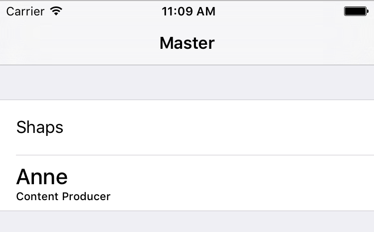

# CellProvider

[](http://cocoapods.org/pods/CellProvider)
[](http://cocoapods.org/pods/CellProvider)
[](http://cocoadocs.org/docsets/CellProvider)
[](http://cocoapods.org/pods/CellProvider)



# Generic Cell Providers

Swift is great, but sometimes working with UIKit can be less safe than hanging off the edge of a cliff without a net.

My cell provider implementation ticks off the following:

* Type-safe cell providers
* Multiple cell types 

I actually wrote this code a long time ago for another library of mine, [Populate](http://github.com/shaps80/Populate).

Populate also includes a more consistent API for dealing with data in your table/collection views. Including type-safety, NSFetchedResultsController-like bindings via a simple Swift array, value-types support, sectioning, sorting, and more.

## Example

```swift
// First register your cell
tableView.register(cellClass: PersonCell.self)
```

```swift
// Then dequeue with a type-safe function
override func tableView(_ tableView: UITableView, cellForRowAt indexPath: IndexPath) -> UITableViewCell {
    let person = people[indexPath.item]
    
    if person.role == "Engineer" {
        let cell = tableView.dequeueReusableCell(ofType: PersonCell.self, for: indexPath)
        cell.textLabel?.text = person.name
        cell.detailTextLabel?.text = person.role
        return cell
    } else {
        let cell = tableView.dequeueReusableCell(with: "SubtitleCell", for: indexPath) as UITableViewCell
        cell.textLabel?.text = person.name
        cell.detailTextLabel?.text = person.role
        return cell
    }
}
```

## Implementation

The key to implementing multiple type-safe cell handling, is the `ResuableView` and `ReusableViewHosting` protocol extensions. It automatically handles all the registration/dequeueing for you -- and all without stringly typed identifiers.

## Installation

This repo includes a simple sample project for your convenience, however in order to use the code, you simply need to copy `CellProvider.swift` into your project. 

Alternatively you can grab the code from GIST, [ReusableView.swift](https://gist.github.com/shaps80/eaa12e5fcddab90a4c6b2fbf321c96e6)

## Platforms and Versions

The following platforms and version have been tested:

* iOS 8.0 and greater
* Swift 3.0

## Author

[@shaps](http://twitter.com/shaps)

## License

All code is available under the MIT license. 
